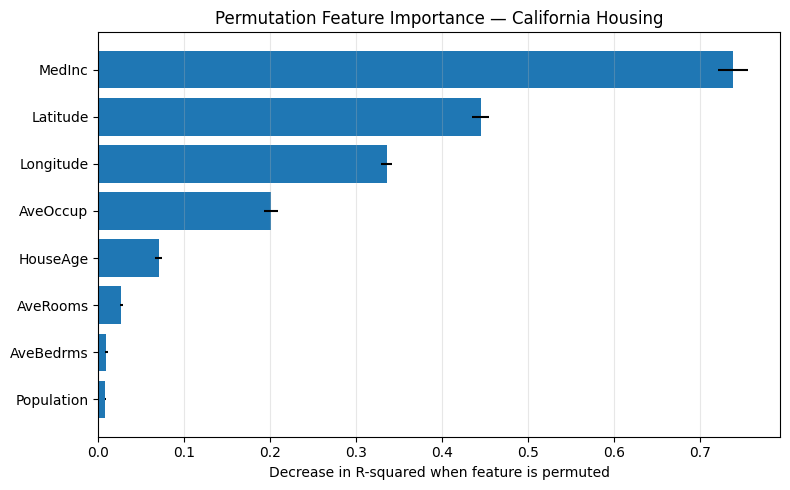

# Permutation Feature Importance (PFI) — Code Tutorial  
### Understanding *why* a model makes accurate predictions

---

## Purpose  

The goal of this demo is to **implement and interpret Permutation Feature Importance (PFI)** — an explainable AI technique that measures how much each feature contributes to a model’s predictive performance.  

PFI helps us move from simply knowing *how well* a model performs to understanding *why* it performs that way.  
By randomly shuffling one feature at a time and observing how much the model’s performance (R²) drops, we can identify which features the model truly relies on.

---

## Dataset  

We use the **California Housing dataset** (from `sklearn.datasets`), which contains information about California districts:  

| Feature | Description |
|----------|--------------|
| `MedInc` | Median income in the district |
| `HouseAge` | Average age of houses |
| `AveRooms` | Average number of rooms per household |
| `AveBedrms` | Average number of bedrooms per household |
| `Population` | District population |
| `AveOccup` | Average household occupancy |
| `Latitude`, `Longitude` | District coordinates (location) |

**Target:** `MedHouseVal` — median house value (in $100,000s)

---

## Model  

We use a **Random Forest Regressor** as our predictive model.  

**Why Random Forest?**
- It captures **non-linear relationships** and **feature interactions** automatically.  
- It provides **strong baseline performance** with minimal tuning.  
- It acts as a **black-box model**, making it ideal for demonstrating how interpretability methods like PFI can reveal what drives predictions internally.  

---

## Method: Permutation Feature Importance  

**How it works:**  
1. Train the model and measure its baseline R-square on the test set.  
2. Shuffle one feature at a time, breaking its relationship with the target.  
3. Measure how much the R-square score drops.  
4. The larger the drop → the more important that feature is.  
5. Repeat multiple times (e.g., 20 shuffles) for stability and calculate mean ± std.

**What it tells us:**  
PFI provides a **global view of feature importance** — showing, on average, which features the model depends on the most across the entire dataset.
We can also visualize the mean drop in R-square (feature importance) as a bar chart with error bars representing the standard deviation across multiple shuffles.

## Results Summary  

- **Median Income (`MedInc`)** is the most influential feature.  
  When shuffled, R² drops from **0.81 → 0.07**, showing the model loses nearly all predictive power.  
- **Latitude** and **Longitude** follow next, capturing strong geographic variation in housing values.  
- Other features (e.g., average rooms, population, house age) have smaller, contextual effects.  
- **Standard deviation (std)** of each feature’s importance is small, meaning results are **stable and consistent** across 20 random shuffles.  

Together, these results show that the Random Forest model is mainly learning **socioeconomic and regional patterns** rather than structural ones.

